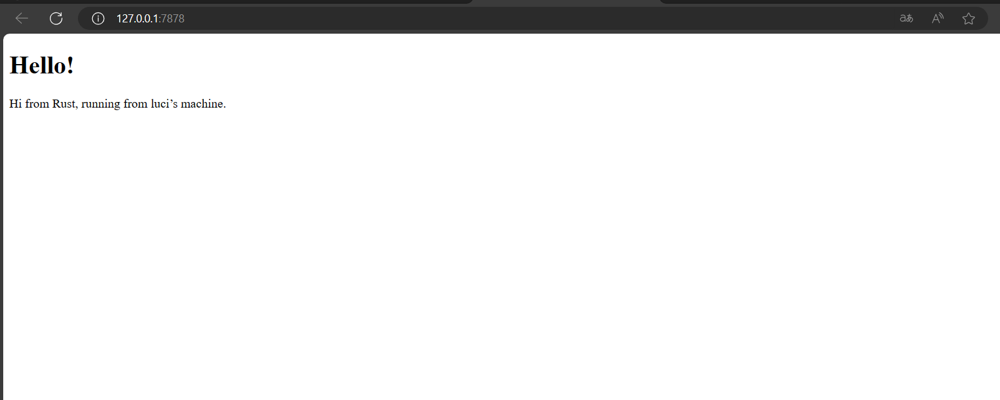
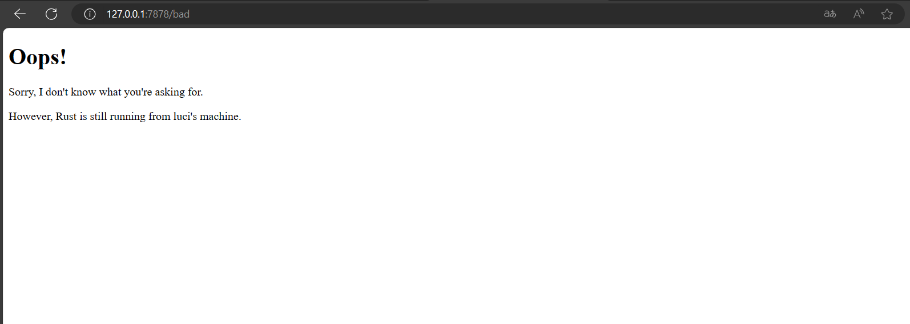

Nama: Lucinda Laurent<br>
Kelas: Adpro B<br>
NPM: 2206024745<br>

## Refleksi Tutorial 6
#### Commit 1 Reflection notes: what is inside the handle_connection method?
`handle_connection` method digunakan untuk membaca data dari TCP (Transmission Control Protocol) stream dan mencetaknya sehingga kita bisa melihat data yang dikirim dari browser. Pada `handle_connection` method, kita membuat instance BufReader yang membungkus mutable reference ke stream. Kemudian kita membuat variabel bernama `http_request` yang akan menyimpan semua baris request yang dikirim dari browser ke server kita ke dalam sebuah vector. Method `lines` akan mengembalikan iterator berupa `Result<String, std::io::Error>` dengan membagi data dari stream sesuai baris-barisnya(ditandai dengan adanya newline byte). Kemudian kita memetakan dan `unwrap` setiap `Result` untuk mendapatkan String tiap barisnya. `take_while` digunakan untuk terus membaca semua baris yang ada sampai program menemukan baris kosong, yang menandakan akhir dari sebuah HTTP request. Setelah semua baris tersimpan di vector, program akan mencetak baris-baris tersebut menggunakan debug formatting yang sudah diatur.
#### Commit 2 Reflection notes: the new handle_connection

Method handle_connection yang baru memungkinkan kita untuk menampilkan pesan tertentu pada halaman html, tidak hanya mencetak di console seperti sebelumnya. <br>
Response terhadap request dari client mengikuti format
```
HTTP-Version Status-Code Reason-Phrase CRLF
headers CRLF
message-body
```
Mengikuti format tersebut, pertama-tama kita buat variabel `status_line` untuk menyimpan HTTP version 1.1, dengan kode status 200, dan reason-phrase "OK". Kita menggunakan `fs::read_to_string` untuk membaca isi file `hello.html` sebagai String. String hasil pembacaan tersebut akan digunakan sebagai body dari response menggunakan `format!`. Untuk memastikan HTTP response-nya valid, kita juga menambahkan header berupa `Content-Length` yang diatur menyesuaikan panjang dari response body alias panjang String hasil pembacaan `hello.html`. HTTP-Version Status-Code Reason-Phrase, header, dan message-body tersebut disatukan menggunakan `format!` yang disimpan sebagai variabel `response`. Terakhir, String `response` tersebut diconvert ke byte dan dikirim ke server. 
#### Commit 3 Reflection notes: How to split between response and why the refactoring is needed?

Saat melakukan commit 1, saya mendapati bentuk request dari browser adalah sebagai berikut
```
Request: [
    "GET / HTTP/1.1",
    "Host: 127.0.0.1:7878",
    "Connection: keep-alive",
    "Cache-Control: max-age=0",
    "sec-ch-ua: \"Chromium\";v=\"122\", \"Not(A:Brand\";v=\"24\", \"Microsoft Edge\";v=\"122\"",
    "sec-ch-ua-mobile: ?0",
    "sec-ch-ua-platform: \"Windows\"",
    "Upgrade-Insecure-Requests: 1",
    "User-Agent: Mozilla/5.0 (Windows NT 10.0; Win64; x64) AppleWebKit/537.36 (KHTML, like Gecko) Chrome/122.0.0.0 Safari/537.36 Edg/122.0.0.0",
    "Accept: text/html,application/xhtml+xml,application/xml;q=0.9,image/avif,image/webp,image/apng,*/*;q=0.8,application/signed-exchange;v=b3;q=0.7",
    "Sec-Fetch-Site: cross-site",
    "Sec-Fetch-Mode: navigate",
    "Sec-Fetch-User: ?1",
    "Sec-Fetch-Dest: document",
    "Accept-Encoding: gzip, deflate, br",
    "Accept-Language: id,en;q=0.9,en-GB;q=0.8,en-US;q=0.7",
]
```
Jika kita jalankan `http://127.0.0.1:7878/bad`, bentuk requestnya menjadi
```
Request: [
    "GET /bad HTTP/1.1",
    "Host: 127.0.0.1:7878",
    "Connection: keep-alive",
    "Cache-Control: max-age=0",
    "sec-ch-ua: \"Chromium\";v=\"122\", \"Not(A:Brand\";v=\"24\", \"Microsoft Edge\";v=\"122\"",
    "sec-ch-ua-mobile: ?0",
    "sec-ch-ua-platform: \"Windows\"",
    "Upgrade-Insecure-Requests: 1",
    "User-Agent: Mozilla/5.0 (Windows NT 10.0; Win64; x64) AppleWebKit/537.36 (KHTML, like Gecko) Chrome/122.0.0.0 Safari/537.36 Edg/122.0.0.0",
    "Accept: text/html,application/xhtml+xml,application/xml;q=0.9,image/avif,image/webp,image/apng,*/*;q=0.8,application/signed-exchange;v=b3;q=0.7",
    "Sec-Fetch-Site: none",
    "Sec-Fetch-Mode: navigate",
    "Sec-Fetch-User: ?1",
    "Sec-Fetch-Dest: document",
    "Accept-Encoding: gzip, deflate, br",
    "Accept-Language: id,en;q=0.9,en-GB;q=0.8,en-US;q=0.7",
]
```
Berdasarkan 2 contoh tersebut, kita jadi tahu bahwa kita bisa membedakan jenis request dari baris pertamanya saja. 
Dengan demikian, kita bisa memisahkan response atas jenis request yang berbeda dengan mengecek baris pertama dari sebuah request. 
Pada kode commit 3, kita membuat variabel `request_line` untuk mendapatkan item pertama dari iterator baris-baris pada request. `request_line` bentuknya seperti `GET / HTTP/1.1` atau `GET /bad HTTP/1.1`. Dengan menggunakan `request_line`, kita bisa melakukan branching untuk mengecek jika request line-nya `GET / HTTP/1.1`(berasal dari url `http://127.0.0.1:7878/` atau `http://127.0.0.1:7878`), maka tampilkan halaman html yang dibuat sebelumnya. Kemudian jika `request_line`nya selain `GET / HTTP/1.1`, maka tampilkan halaman error yang kita baru buat. <br>
Pada kode 
```rust
// --snip--

fn handle_connection(mut stream: TcpStream) {
    let buf_reader = BufReader::new(&mut stream);
    let request_line = buf_reader.lines().next().unwrap().unwrap();

    if request_line == "GET / HTTP/1.1" {
        let status_line = "HTTP/1.1 200 OK";
        let contents = fs::read_to_string("hello.html").unwrap();
        let length = contents.len();

        let response = format!(
            "{status_line}\r\nContent-Length: {length}\r\n\r\n{contents}"
        );

        stream.write_all(response.as_bytes()).unwrap();
    } 
    ...
 ```
 dan 
 ```rust
    ...
    else {
        let status_line = "HTTP/1.1 404 NOT FOUND";
        let contents = fs::read_to_string("404.html").unwrap();
        let length = contents.len();

        let response = format!(
            "{status_line}\r\nContent-Length: {length}\r\n\r\n{contents}"
        );

        stream.write_all(response.as_bytes()).unwrap();
    }
}
```
terlihat banyak redundansi kode, terutama saat membuat variabel `response` dan melakukan perintah `write_all`. Kedua bagian kode tersebut sebenarnya melakukan hal yang sama, yaitu membaca file dan menuliskan isinya ke stream. Hal yang membedakan keduanya hanya nilai variabel `status_line` dan `filename`. Oleh karena itu, kita bisa melakukan refactor agar kodenya lebih ringkas dan mudah dibaca dengan membuat conditional hanya untuk assign nilai variabel `status_line` dan `filename`.
Hasilnya menjadi seperti berikut
```rust
// --snip--

fn handle_connection(mut stream: TcpStream) {
    // --snip--

    let (status_line, filename) = if request_line == "GET / HTTP/1.1" {
        ("HTTP/1.1 200 OK", "hello.html")
    } else {
        ("HTTP/1.1 404 NOT FOUND", "404.html")
    };

    let contents = fs::read_to_string(filename).unwrap();
    let length = contents.len();

    let response =
        format!("{status_line}\r\nContent-Length: {length}\r\n\r\n{contents}");

    stream.write_all(response.as_bytes()).unwrap();
}
```